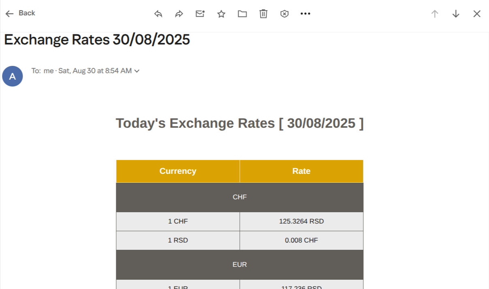

# Exchange Rates Notifier
A simple Python script that fetches currency exchange rates and sends them via email.

---

## Project Description
This project uses [Open Exchange Rates API](https://openexchangerates.org/)  to fetch currency data.
It is a Python script, designed to automate the process of checking currency exchange rates and sending a personalized email report. The application can be run manually or scheduled to run automatically using tools like **cron** (on Linux/macOS) or **Task Scheduler** (on Windows).

Key features include:
- Fetching the latest currency rates from an external API.
- Generating a professional HTML email body with a detailed rate table.
- Sending the email to a specified recipient.
- Using a `.env` file to securely store sensitive information like API keys and passwords.


## Screenshots


---

## Getting Started

### 1. Clone the Repository
Start by cloning the project from GitHub to your local machine:

```bash
git clone git@github.com:spezia/exchange-rates-notifier.git
```


### 2. Configure Environment Variables
Create a `.env` file in the project's root directory. This file will store your sensitive information and is ignored by Git to ensure your data remains secure.  
Fill it with the following variables, replacing the values with your own:

```env
EXCHANGE_API_KEY="your_exchange_rate_api_key"
EXCHANGE_URL="https://openexchangerates.org/api/latest.json"

LIST_CURRENCIES="USD,EUR,GBP,JPY,CAD,AUD,CHF,CNY"
DEF_CURRENCY="EUR"

SMTP_SERVER="smtp.gmail.com"
SMTP_PORT=465
EMAIL_SENDER="your_email@gmail.com"
EMAIL_PASSWORD="your_app_password"
EMAIL_RECEIVER="recipient_email@example.com"
```

*Note:* If you are using Gmail, you must generate an **App Password**. Use this password for **EMAIL_PASSWORD** in the `.env` file.

### 3. Install Dependencies
Install the necessary Python libraries :

```bash
pip install -r requirements.txt
```

### 4. Run the Script

```bash
python main.py
```

Upon successful execution, you should receive an email with the exchange rate table.

### 5. Run the Tests

The tests use Python's built-in `unittest` module, so there is nothing extra to install.
Run them from the project root:

```bash
python -m unittest discover
```

Add `-v` to see the name of every test:

```bash
python -m unittest discover -v
```

The exchange rates API is mocked, so the tests need no API key, no `.env` file and no internet connection.


---

## License

Exchange Rates Notifier is released under the MIT License. See the [MIT](./LICENSE) file for details.
